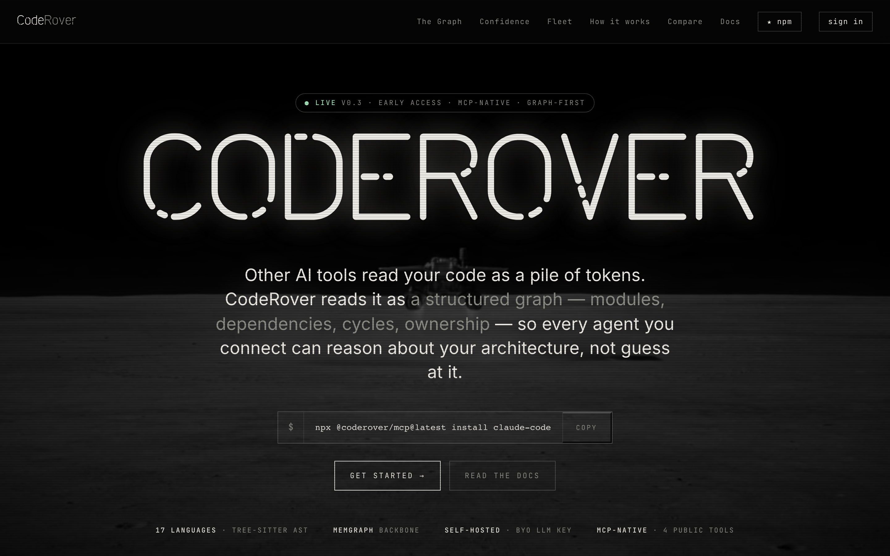
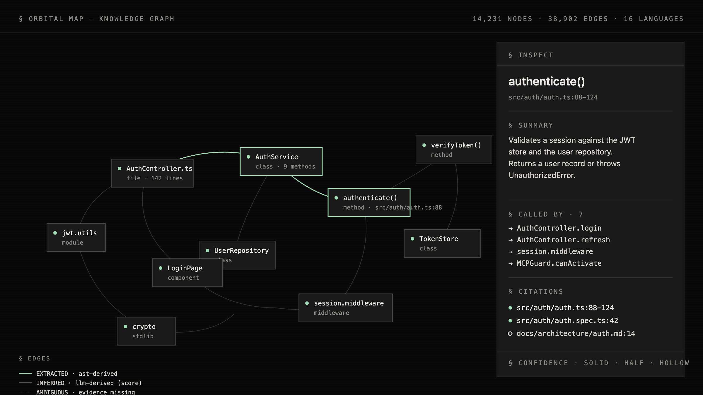
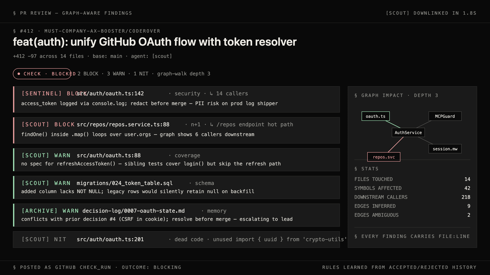
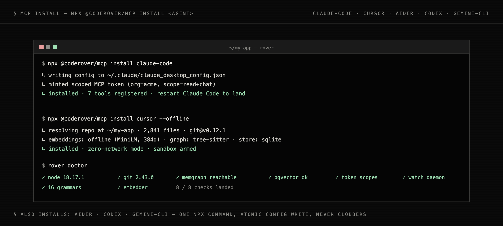
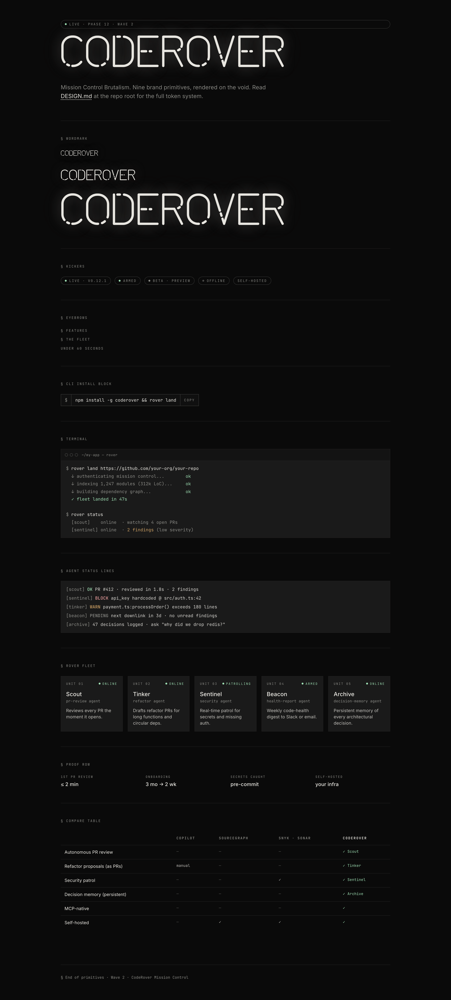
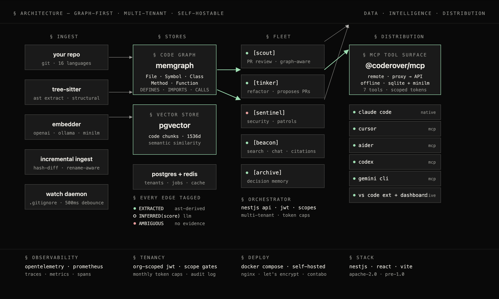

<h1 align="center">CodeRover</h1>

<p align="center">
  <strong>Graph-native AI copilot for large codebases.</strong>
  <br />
  <em>An autonomous fleet of five agents that review PRs, patrol security, refactor dead code, and answer with cited evidence.</em>
  <br />
  <em>MCP-wired into Claude Code, Cursor, Aider, Codex, and Gemini CLI.</em>
</p>

<p align="center">
  <a href="https://www.star-history.com/#MUST-Company-AX-Booster/coderover">
    <picture>
      <source media="(prefers-color-scheme: dark)" srcset="https://api.star-history.com/badge?repo=MUST-Company-AX-Booster/coderover&theme=dark" />
      <source media="(prefers-color-scheme: light)" srcset="https://api.star-history.com/badge?repo=MUST-Company-AX-Booster/coderover" />
      
    </picture>
  </a>
</p>

<p align="center">
  <a href="#-quick-start"></a>
  <a href="./LICENSE"></a>
  <a href="https://www.npmjs.com/package/@coderover/mcp"></a>
  <a href="https://docs.anthropic.com/en/docs/claude-code"></a>
  <a href="#cursor"></a>
  <a href="#aider"></a>
  <a href="#codex"></a>
  <a href="#gemini-cli"></a>
  <a href="https://github.com/MUST-Company-AX-Booster/coderover/discussions"></a>
  <a href="https://coderover.must.company"></a>
</p>

<p align="center">
  
</p>

<p align="center">
  <strong>💬 <a href="https://github.com/MUST-Company-AX-Booster/coderover/discussions">Join the discussion &rarr;</a></strong>
  <br />
  <em>Usage questions, design conversations, "how do I…" — all welcome.</em>
</p>

---

> [!TIP]
> **`[scout]` reviewed 218 PRs across 14 design-partner repos this month.** If CodeRover saves your team a few hours of context-switching per week, that's the goal. Star the repo if it lands.

**You opened a 200,000-line monorepo. Cursor knows the file. Copilot autocompletes the line. Neither of them knows that the function you just edited has 412 callers across six services — and one of them ships PII to the audit log.**

CodeRover is an autonomous fleet of five AI agents — `[scout]`, `[tinker]`, `[sentinel]`, `[beacon]`, and `[archive]` — that operate against a **graph of your code, not a window of it**. Memgraph stores files, classes, methods, and the edges between them. Every edge carries a confidence tag, so the LLM can cite truth and the graph can flag a hallucination. Plug the fleet into your agent of choice over MCP, or run the dashboard self-hosted on your own infra.

> **Graph-aware. Self-hosted. Five rovers. One clean room.**

---

## ✨ Features

> [!NOTE]
> **Want to skip the reading?** The landing page at [**coderover.must.company**](https://coderover.must.company) ships a brand-film overview and live screenshots. The `/design-system` route shows every UI primitive in isolation.

### Reason against your code graph

Tree-sitter walks 16 languages and writes the structural skeleton — files, symbols, classes, methods, imports, calls, inheritance — into Memgraph. Every edge is tagged `EXTRACTED`, `INFERRED(score)`, or `AMBIGUOUS`, so when an agent answers a question you can tell what came from the AST and what came from a probabilistic guess. Citations on every answer are `file:line_start-line_end` pairs, not paraphrase.

<p align="center">
  
</p>

### Catch regressions before they land

`[scout]` runs as a GitHub `check_run` on every PR. It walks the change against the graph, surfaces downstream callers, runs `[sentinel]` for security findings in the same pass, and either blocks, warns, or approves. Every finding shows `agent · severity · file:line · category` — never paraphrase, never marketing prose, and never a finding without a path you can click.

<p align="center">
  
</p>

### Install into any agent in one command

`@coderover/mcp` is one `npx` command. It atomically writes a config block into your agent's MCP config file, mints a scoped JWT against your CodeRover org, and installs seven graph-aware tools. Run **remote** (HTTP proxy to a self-hosted API) or **offline** (embedded SQLite + sqlite-vec + tree-sitter + MiniLM, zero network).

<p align="center">
  
</p>

### Operate the fleet from a brand-locked Mission Control

The dashboard is React + Vite + shadcn/ui under a custom design system — bone on void, BOKEH wordmark, brutalist border-radius `0`, brand-film scanlines. Every primitive (Wordmark, Eyebrow, Kicker, Terminal, RoverBadge, AgentStatusLine, CompareTable) is exposed at the public `/design-system` route as a living spec, so designers and contributors never drift from the tokens in [`DESIGN.md`](./DESIGN.md). The screenshot below is rendered from the live frontend.

<p align="center">
  
</p>

<table>
  <tr>
    <td width="50%" valign="top">
      <h3>🛰️ Five-Agent Fleet</h3>
      <p><code>[scout]</code> reviews PRs · <code>[tinker]</code> proposes refactors · <code>[sentinel]</code> patrols security · <code>[beacon]</code> answers chat with citations · <code>[archive]</code> remembers decisions across PRs.</p>
    </td>
    <td width="50%" valign="top">
      <h3>🧭 Mission Control Dashboard</h3>
      <p>React + Vite frontend with Orbital Map (React Flow), terminal-style chat, PR review feed, search with file:line citations, fleet status, and a public <code>/design-system</code> route.</p>
    </td>
  </tr>
  <tr>
    <td width="50%" valign="top">
      <h3>📐 Confidence-Tagged Edges</h3>
      <p>Every graph edge carries <code>EXTRACTED</code> (AST), <code>INFERRED(score)</code> (LLM), or <code>AMBIGUOUS</code> (no evidence). Confidence glyphs (solid / half / hollow) read in grayscale and pass WCAG AA.</p>
    </td>
    <td width="50%" valign="top">
      <h3>🔁 Incremental Ingest</h3>
      <p>Hash-diffed re-ingest — only changed files re-analyze. Rename-aware (preserves edges via qualified-name identity). Watch daemon honors <code>.gitignore</code> with 500ms debounce.</p>
    </td>
  </tr>
  <tr>
    <td width="50%" valign="top">
      <h3>🏢 Multi-Tenant by Default</h3>
      <p>Per-org scoping on every tenant table. Scope-gated JWTs for MCP. Monthly token caps per org. OpenTelemetry + Prometheus out of the box.</p>
    </td>
    <td width="50%" valign="top">
      <h3>🧠 Decision Memory</h3>
      <p><code>[archive]</code> persists architectural decisions and surfaces them in PR review. New PRs that contradict a prior decision get flagged before merge — never re-litigate the same call.</p>
    </td>
  </tr>
  <tr>
    <td width="50%" valign="top">
      <h3>🌐 16 Tree-Sitter Languages</h3>
      <p>JS / TS, Python, Go, Rust, Java, Kotlin, PHP, Swift, Ruby, C, C++, C#, HTML, CSS, Bash, and more — same graph schema across all of them.</p>
    </td>
    <td width="50%" valign="top">
      <h3>🪞 Offline Mode</h3>
      <p><code>@coderover/mcp-offline</code> ships a MiniLM embedder + SQLite-vec + tree-sitter pipeline so the fleet runs against your repo with zero network calls. Air-gapped friendly.</p>
    </td>
  </tr>
</table>

---

## 🚀 Quick Start

### 1. Install the MCP package into your agent

```bash
npx @coderover/mcp install claude-code
# Also supported: cursor, aider, codex, gemini-cli
```

The installer writes an atomic config update to your agent's MCP config file and walks you through getting a scoped token. Add `--offline` to run with no backend (uses `@coderover/mcp-offline`).

### 2. Or self-host the whole stack

```bash
git clone https://github.com/MUST-Company-AX-Booster/coderover.git
cd coderover
cp coderover-api/.env.example coderover-api/.env   # set JWT_SECRET, GITHUB_*, OPENAI_API_KEY
docker compose -f coderover-api/docker-compose.yml up -d
```

Brings up Postgres 16 + pgvector, Redis 7, Memgraph, the NestJS API, and the React frontend. Full first-run, env vars, and migrations are in [`SETUP.md`](./SETUP.md).

### 3. Ingest a repo

```bash
# From the dashboard at http://localhost:5173/repos — click "Add repository"
# or via the MCP surface inside your agent:
rover ingest /path/to/your/repo
```

A multi-agent pipeline scans the repo, extracts every file, function, class, and dependency, and writes the graph to Memgraph + embeddings to pgvector. Incremental — re-runs only re-analyze what changed.

### 4. Open Mission Control

```bash
open http://localhost:5173
```

The dashboard shows the fleet (`[scout]` `[tinker]` `[sentinel]` `[beacon]` `[archive]`), the Orbital Map of your code graph, the PR review feed, search with `file:line` citations, and the live `/design-system` spec.

```bash
# In your agent, ask anything against the graph:
> what calls authenticate()?
> diff impact for branch fix/oauth-state
> who decided we use refresh tokens in cookies?
> /search anomaly detection in the watch daemon
```

---

## 🌐 Multi-Platform Installation

CodeRover speaks MCP. Any agent that supports MCP can call the seven graph-aware tools.

### Claude Code

```bash
npx @coderover/mcp install claude-code
```

Writes to `~/.claude/claude_desktop_config.json`. Restart Claude Code to load. The tool surface appears under `coderover` in the MCP picker.

### Cursor

```bash
npx @coderover/mcp install cursor
```

Writes to `~/Library/Application Support/Cursor/User/globalStorage/mcp.json` (mac) or the equivalent on Linux/Windows. Reload the Cursor window.

### Aider

```bash
npx @coderover/mcp install aider
```

Adds the CodeRover MCP server to `~/.aider.conf.yml`. Run `aider --mcp` to load.

### Codex

```bash
npx @coderover/mcp install codex
```

Adds the server to `~/.codex/mcp.json`. Codex picks it up on next launch.

### Gemini CLI

```bash
npx @coderover/mcp install gemini-cli
```

Writes to `~/.gemini/mcp_servers.json`. Tools land under `coderover.*`.

### Offline mode (any client)

```bash
npx @coderover/mcp install <agent> --offline
# or pin the offline embedder package directly:
npm i -g @coderover/mcp-offline
```

Embedded SQLite + sqlite-vec + tree-sitter + MiniLM. Zero network calls after install. Useful for air-gapped envs and local development.

### VS Code extension

The CodeRover VS Code extension (in [`coderover-api/vscode-extension/`](./coderover-api/vscode-extension)) ships chat + PR review inside the editor with SSE streaming and SecretStorage-backed tokens. Install from the Marketplace or sideload the `.vsix` from the latest release.

### Self-hosted dashboard

```bash
docker compose -f coderover-api/docker-compose.yml up -d
```

Brings up Mission Control at `http://localhost:5173`. Production deploy runbook (nginx, Let's Encrypt, Contabo VPS) lives at [`docs/deploy/RUNBOOK.md`](./docs/deploy/RUNBOOK.md).

### Platform Compatibility

| Platform | Status | Install Method |
|----------|--------|----------------|
| Claude Code | ✅ Supported | `npx @coderover/mcp install claude-code` |
| Cursor | ✅ Supported | `npx @coderover/mcp install cursor` |
| Aider | ✅ Supported | `npx @coderover/mcp install aider` |
| Codex | ✅ Supported | `npx @coderover/mcp install codex` |
| Gemini CLI | ✅ Supported | `npx @coderover/mcp install gemini-cli` |
| VS Code (extension) | ✅ Supported | Marketplace / `.vsix` sideload |
| Mission Control (dashboard) | ✅ Supported | `docker compose up -d` |
| Offline / air-gapped | ✅ Supported | `--offline` flag or `@coderover/mcp-offline` |
| Custom MCP client | ✅ Supported | Point at `@coderover/mcp` directly |

---

## 📦 Self-host & Share with Your Team

CodeRover is **self-hosted by default**. There is no hosted SaaS gating. You bring the infra; the rovers bring the intelligence.

> **Reference deploy:** Contabo VPS · nginx + Let's Encrypt · Docker Compose · single-domain routing for landing + SPA + API. Full runbook in [`docs/deploy/RUNBOOK.md`](./docs/deploy/RUNBOOK.md).

**Bring up the stack:**

```bash
docker compose -f coderover-api/docker-compose.yml up -d
```

Postgres 16 (pgvector), Redis 7, Memgraph (memgraph-mage), NestJS API, React frontend. Migrations run on first boot.

**Multi-tenant:** every tenant table has `org_id`. JWTs carry `orgId` + scope. Monthly token caps per org. The MCP installer mints scoped tokens per machine.

**Observability:** OpenTelemetry traces, Prometheus metrics, and a Phase 9 ops runbook for token caps + rollback at [`docs/runbook-phase9.md`](./docs/runbook-phase9.md).

**Security:** AES-256-GCM at rest for `system_settings` rows flagged secret. CSRF-state OAuth flow. Scoped JWTs for MCP. Private vulnerability disclosure via [`SECURITY.md`](./SECURITY.md).

---

## 🔧 Under the Hood

<p align="center">
  
</p>

### Five-Agent Fleet

| Agent          | Role                                                                            |
|----------------|---------------------------------------------------------------------------------|
| `[scout]`      | PR review · graph-aware impact analysis · learns from accepted/rejected history |
| `[tinker]`     | Refactor proposals as PRs · dead-code removal · API surface cleanup             |
| `[sentinel]`   | Security patrols · secret leakage · auth-flow regressions · OWASP categories    |
| `[beacon]`     | In-app chat + search · semantic + graph traversal · `file:line` citations       |
| `[archive]`    | Decision memory · surfaces prior calls in PR review · prevents re-litigation    |

### Pipeline

1. **Ingest.** Tree-sitter extracts AST nodes (file, symbol, class, method, function) and AST edges (defines, imports, calls, inherits, depends-on). Embedder (OpenAI / OpenRouter / Ollama / offline MiniLM) chunks code and writes vectors. Hash-diffed and rename-aware.
2. **Stores.** Memgraph holds the structural graph. pgvector holds the semantic index. Postgres holds tenants, jobs, audit, and decision rows. Redis holds the content cache and the watch-daemon hash index.
3. **Fleet.** The NestJS API orchestrates the five rovers. Each call is org-scoped, scope-gated, and logged.
4. **Distribution.** `@coderover/mcp` exposes seven tools over MCP for Claude Code, Cursor, Aider, Codex, Gemini CLI. The dashboard is served by the same API.

### Confidence Layer

Every graph edge ships with one of three tags:

- **`EXTRACTED`** — AST-derived. The compiler sees it. Trust it.
- **`INFERRED(score)`** — LLM-derived with a numeric confidence. Useful for cross-language calls, dynamic dispatch, framework-magic relationships.
- **`AMBIGUOUS`** — no evidence either way. The agent is told to flag, never assert.

Citations in the dashboard render `solid / half / hollow` glyphs that read in grayscale and pass WCAG AA. The LLM is forbidden from claiming a relationship the graph hasn't tagged.

---

## 🧭 Why CodeRover

CodeRover doesn't replace your editor, your security scanner, or your code-search tool — it's the **graph-reasoning and human-approval layer** those tools don't ship.

|                                     | Copilot / Cursor | Sourcegraph    | Greptile           | **CodeRover**            |
| ----------------------------------- | ---------------- | -------------- | ------------------ | ------------------------ |
| Code graph with confidence tags     | —                | partial        | —                  | ✅                        |
| Cycle / impact / hotspot queries    | —                | read-only      | —                  | ✅                        |
| Autonomous PR review                | —                | —              | ✅                  | ✅ *(graph-aware)*        |
| Refactor proposals as PRs           | manual           | —              | —                  | ✅                        |
| Team decision memory                | —                | —              | —                  | ✅                        |
| MCP-native tool surface             | —                | —              | —                  | ✅                        |
| Self-hosted + open-source           | —                | enterprise     | —                  | ✅ *(Apache 2.0)*         |
| Offline / air-gapped mode           | —                | —              | —                  | ✅                        |

If you have a 10k-line monorepo, your editor's built-in features are enough — you don't need a fleet. CodeRover earns its keep around 500k+ lines, where "grep" and "ask Cursor" stop working because the answer depends on structural relationships the editor can't see.

---

## 📚 Documentation

- [`SETUP.md`](./SETUP.md) — first-run setup, env vars, migrations, MCP install.
- [`ROADMAP.md`](./ROADMAP.md) — what shipped per phase and what's coming next.
- [`CHANGELOG.md`](./CHANGELOG.md) — release history with migration notes.
- [`DESIGN.md`](./DESIGN.md) — design system, brand voice, component inventory, decisions log.
- [`docs/runbook-phase9.md`](./docs/runbook-phase9.md) — Phase 9 ops (OTel, Prometheus, token caps, rollback).
- [`docs/runbook-phase10.md`](./docs/runbook-phase10.md) — Phase 10 ops (MCP, confidence tags, watch daemon).
- [`docs/deploy/RUNBOOK.md`](./docs/deploy/RUNBOOK.md) — production deploy runbook.

> [!IMPORTANT]
> **Status: pre-1.0.** APIs, schemas, and configuration evolve between releases. Pin a tagged version for anything production-adjacent. Phase 12 just landed (Mission Control Brutalism) — see [`CHANGELOG.md`](./CHANGELOG.md#0120).

---

## 🤝 Contributing

PRs welcome. Read [`CONTRIBUTING.md`](./CONTRIBUTING.md) first — it covers branch naming, conventional commits, the PR checklist, tenant-isolation invariants, and how to propose security-sensitive changes.

For visual changes, also read [`DESIGN.md`](./DESIGN.md) and [`CLAUDE.md`](./CLAUDE.md) at the repo root. The design system is locked; unauthorized palette or font additions will be rejected in review.

1. Fork the repository
2. Create a feature branch (`git checkout -b feature/my-feature`)
3. Run the API tests (`cd coderover-api && npm test`)
4. Run the frontend tests (`cd coderover-frontend && npm test`)
5. Commit with conventional-commit prefixes (`feat:`, `fix:`, `chore:`, `docs:`)
6. Open a pull request — `[scout]` will review it

Open an issue first for major changes so we can discuss the approach. Security-sensitive proposals should follow the private disclosure path in [`SECURITY.md`](./SECURITY.md).

---

## 🌟 Community

- **Website:** [coderover.must.company](https://coderover.must.company)
- **Discussions:** [github.com/MUST-Company-AX-Booster/coderover/discussions](https://github.com/MUST-Company-AX-Booster/coderover/discussions)
- **Issues:** [github.com/MUST-Company-AX-Booster/coderover/issues](https://github.com/MUST-Company-AX-Booster/coderover/issues)
- **Security:** [`SECURITY.md`](./SECURITY.md) — private vulnerability disclosure
- **Code of Conduct:** [`CODE_OF_CONDUCT.md`](./CODE_OF_CONDUCT.md)

If CodeRover saves your team time, **a star helps us reach the next engineering org that needs it.**

---

<p align="center">
  <strong>Stop reading code blind. Start reasoning against the graph.</strong>
</p>

## Star History

<a href="https://www.star-history.com/#MUST-Company-AX-Booster/coderover&Date">
  <picture>
    <source media="(prefers-color-scheme: dark)" srcset="https://api.star-history.com/svg?repos=MUST-Company-AX-Booster/coderover&type=Date&theme=dark" />
    <source media="(prefers-color-scheme: light)" srcset="https://api.star-history.com/svg?repos=MUST-Company-AX-Booster/coderover&type=Date" />
    
  </picture>
</a>

<p align="center">
  <a href="./LICENSE">Apache License 2.0</a> · Copyright 2026 MUST Company.
</p>

<p align="center">
  <em>§ rover · landed</em>
</p>
